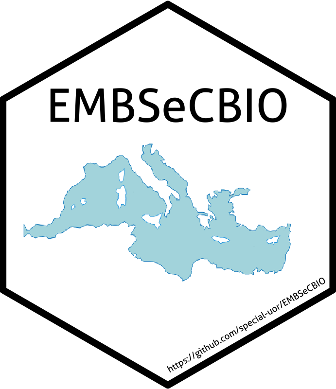

<!-- README.md is generated from README.Rmd. Please edit that file -->

```{r, include = FALSE}
knitr::opts_chunk$set(
  collapse = TRUE,
  comment = "#>",
  fig.path = "man/figures/README-",
  out.width = "100%"
)
```

# EMBSeCBIO 

<!-- badges: start -->
`r badger::badge_devel("special-uor/embsecbio", "yellow")`
`r badger::badge_cran_release("embsecbio", "black")`
`r badger::badge_github_actions("special-uor/embsecbio")`
<!-- badges: end -->

The goal of EMBSeCBIO is to provide functions to work with the Eastern Mediterranean-Black Sea-Caspian-Corridor region and biome reconstructions database.

## Installation

You can(not) install the released version of EMBSeCBIO from [CRAN](https://CRAN.R-project.org) with:

``` r
# install.packages("embsecbio")
```

And the development version from [GitHub](https://github.com/) with:

``` r
# install.packages("devtools")
devtools::install_github("special-uor/embsecbio")
```
## Example

Obtain the top 10 sites and their corresponding metadata:
```{r}
`%>%` <- magrittr::`%>%`
embsecbio::site %>%
  dplyr::slice(1:10) %>%
  knitr::kable()
```


Obtain the top 10 entities and their corresponding metadata:
```{r}
`%>%` <- magrittr::`%>%`
embsecbio::entity %>%
  dplyr::slice(1:10) %>%
  knitr::kable()
```


Find entities linked to sites:
```{r}
`%>%` <- magrittr::`%>%`
ents <- embsecbio::site %>%
  dplyr::slice(1:4) %>%
  embsecbio::get_entities()

ents %>%
  knitr::kable()
```

<!-- This is a basic example which shows you how to solve a common problem: -->

<!-- ```{r example} -->
<!-- library(embsecbio) -->
<!-- ## basic example code -->
<!-- ``` -->

## Datasets

1. Harrison, Sandy and Marinova, Elena (2017): EMBSeCBIO modern pollen biomisation. University of Reading. Dataset. http://dx.doi.org/10.17864/1947.109
